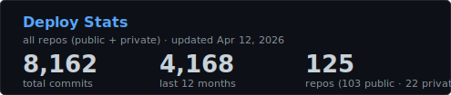

<a href="https://github.com/tillo13">

</a>

<table>
<tr>
<td width="60%" valign="top">

### what I'm about

I build AI-powered apps, games, and tools — mostly in Python, mostly deployed to GCP, mostly because I wanted to see if it would work.

125 repos (103 public, 22 private). Various LLMs tie in to help, but Flask/Python mostly. Everything from Mars colony simulators on Ethereum to reverse-engineered Grok clients to a 3D brain that visualizes ideas as floating orbs.

<br/>

**Things I'm digging recently:**
- 🔴 **[Pilgrims](https://pilgri.ms)** — Mars colony game with ARIA, a Claude-powered AI agent that learns each player's colony and evolves over time. Blockchain integration on Ethereum Sepolia. Previous iteration: [pilgrim.games](https://pilgrim.games) — [source](https://github.com/tillo13/pilgri.ms_public)
- 🧠 **[Kumori](https://kumori.ai)** — Personal AI assistant you actually own. Runs on your API keys, Claude-powered, deployed to GCP. The infrastructure layer behind most of my apps.
- 🗺️ **[Crab Travel](https://crab.travel)** — AI-powered travel planning. Claude builds itineraries, scores destinations, handles the entire trip research pipeline autonomously.
- 🤝 **[Dandy Ventures](https://dandy.ventures)** — Collaborative chat where multiple users talk with Claude together in real-time, plus an AI-guided startup intake system for vetting ideas.
- 🏋️ **[Wattson](https://wattson.ac)** — B2B SaaS gym equipment monitoring via Shelly smart plugs. Full startup pitch, pricing model, and exit strategy. Built the entire business case with AI.
- 🎬 **[Digital Empire TV](https://digitalempiretv.com)** — YouTube gaming network dashboard. AI-driven content analysis and channel performance tracking on GCP.
- 🔗 **[Briskr](https://bris.kr)** — Privacy-first URL shortener. No tracking, no ads, no BS. Just short links that respect your users.
- 📰 **[Refinr](https://sortedfor.me)** — Reddit aggregator that surfaces signal from noise. AI ranks and clusters discussions so you don't have to scroll.
- ✅ **[Trustable](https://trustable.cc)** — Professional trust layer. Get rated by peers, rank your network — built as the QA backbone for testing across my other projects.
- 🎭 **[Meish](https://meish.cc)** — AI writing style cloning. Feed it your samples, it learns your voice, then generates articles that sound like you wrote them.
- 🔍 **[Inroads](https://inroads.me)** — Network-first job search. 70-85% of jobs are filled through referrals — Inroads scrapes 597+ career pages and matches them against your LinkedIn connections.
- 🧩 **[MrBeast Puzzle](https://github.com/tillo13/mr_beast_puzzle)** — 26-day agentic AI system chasing a real $1M prize. Scrapers, vision analysis, Slack bot, autonomous evidence gathering. The full retrospective.
- 💡 **[Scatterbrain](https://github.com/tillo13/scatterbrain)** — 3D visualization of your scattered brain. Every project, email, meeting, and task rendered as glowing orbs floating in space. Agent-driven email triage, calendar sync, and auto-fix pipelines.
- 🎬 **[ROG Video Pipeline](https://github.com/tillo13/ai-video-pipeline)** — Claude Agent Skills architecture. AI writes scripts, generates images, sings, edits, and uploads videos autonomously. End-to-end content creation with zero human intervention.
- 🖥️ **ROG Gateway** — 65+ API endpoints serving LLMs, TTS, music gen, Whisper, and image/video models from a local RTX 5060 Ti `private`
- 🐕 **[Pet Adoption AI](https://github.com/tillo13/pet-adoption-ai)** — AI-generated promotional art for shelter pets. Trains a custom LoRA model on each animal's photos, then generates stylized artwork to help them get adopted.
- 🎭 **[Kindness Social](https://github.com/tillo13/kindness_social)** — 20 autonomous AI personas simulating social media. Gamified kindness with dopamine rewards — achieved 55% toxicity reduction over 69 simulated hours.

</td>
<td width="40%" valign="top">




</td>
</tr>
</table>


---

### featured projects

<table>
<tr>
<td width="50%" valign="top">

#### 🎬 AI Video & Image Generation
[](https://github.com/tillo13/ai_storyboard_video_generator)
<br/>End-to-end story → visuals → voiceover → video pipeline

[](https://github.com/tillo13/kumori_cli_engine)
<br/>Identity-preserving stylized portraits via InstantID + HuggingFace

[](https://github.com/tillo13/studio_ghibli_faceswap)
<br/>Turn anyone into a Studio Ghibli character

[](https://github.com/tillo13/ai_video_creator)
<br/>Flux + CivitAI + RunwayML + Suno in one pipeline

</td>
<td width="50%" valign="top">

#### 🤖 LLMs & AI Tools
[](https://github.com/tillo13/ollama_storyline_creator)
<br/>AI-driven narrative generation with chapter coherence

[](https://github.com/tillo13/auto_ai_chooser)
<br/>Meta-router that picks the best AI model for each query

[](https://github.com/tillo13/kindness_social)
<br/>20 AI personas testing if gamified kindness reduces toxicity

[](https://github.com/tillo13/dr_nick) `[private]`
<br/>Privacy-first reverse-engineered Grok client

</td>
</tr>
<tr>
<td width="50%" valign="top">

#### 🌍 Web Apps & Products
[](https://github.com/tillo13/scatterbrain) `[private]`
<br/>3D brain — your chaos, made visible (Three.js + Flask)

[](https://github.com/tillo13/pilgri.ms_public)
<br/>Mars colony game with real blockchain + AI commanders

[](https://github.com/tillo13/refinr) `[private]`
<br/>Reddit signal extraction — sortedfor.me

[](https://github.com/tillo13/wattson) `[private]`
<br/>B2B gym equipment monitoring via smart plugs

</td>
<td width="50%" valign="top">

#### 🧪 Experiments & Fun
[](https://github.com/tillo13/mr_beast_puzzle)
<br/>AI-assisted $1M MrBeast × Salesforce puzzle solver

[](https://github.com/tillo13/flux_local_inference_via_ostris)
<br/>LoRA training toolkit for systems with limited VRAM

[](https://github.com/tillo13/rog_gateway) `[private]`
<br/>Unified GPU API gateway for local RTX inference

[](https://github.com/tillo13/adventure-dnd)
<br/>1982 Intellivision D&D recreation, built from memory

</td>
</tr>
</table>

---

### how I build

```
python + flask + vanilla js + postgresql + gcp app engine
```

No React. No Next.js. No Kubernetes. Just Python, raw SQL, and `deploy "it works"`.

Every project follows the same pattern: **idea → prototype → deploy → iterate**. If it takes more than a weekend to get live, the architecture is wrong.

<table>
<tr>
<td>

**Stack**|**Tools**
:--|:--
Languages | Python (81 repos), JavaScript, Go, Shell
AI/ML | Flux, SDXL, Ollama, LLaMA, Claude, GPT-4, InstantID, HuggingFace Diffusers
Backend | Flask, gunicorn, PostgreSQL (Cloud SQL), SQLite
Frontend | Three.js, vanilla JS, HTML/CSS
Infra | GCP App Engine, Cloud Run, Secret Manager, Cloud Scheduler
Blockchain | Ethereum Sepolia (web3.py)

</td>
</tr>
</table>

---

<p align="center">
<a href="https://www.linkedin.com/in/andytillo/">

</a>
<a href="https://github.com/tillo13?tab=repositories">

</a>
<a href="https://pilgri.ms">

</a>
</p>


